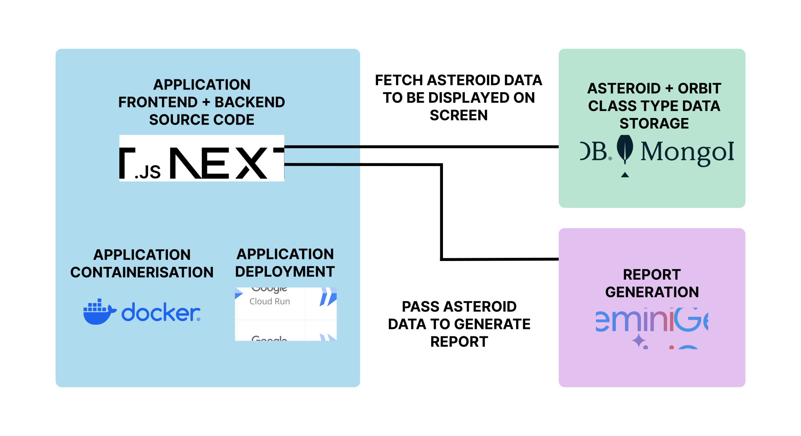
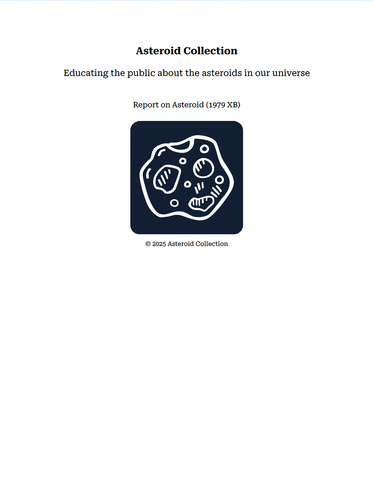

# Google Cloud AI In Action App
This repository hosts the full-stack application for an asteroid collection project. The application was developed as part of a submission to the MongoDB Challenge of the Google Cloud AI in Action Hackathon of June 2025.

Asteroid Collection is an educational platform that strives to educate the public on the asteroids in our universe. Users may browse a rich catalogue of asteroid data and generate PDF reports on asteroids of their choosing.

The application is powered by Next.js, using HTML, CSS and TypeScript on the frontend with a Node.js backend. The backend uses the Node.js MongoDB driver to connect to a MonogoDB NoSQL asteroid database to fetch and display detailed information about thousands of known asteroids.



## Local Environment Setup

You need to set up the environment on your local device to work with the requisite tools and libraries so that the application can run.

Ensure that [git](https://git-scm.com/downloads) is installed on your device.

Ensure that [Node.js](https://nodejs.org/en/download) version 18 or above (preferably at least version 20) is installed on your device. Node.js bundles npm (node package manager), and so downloading the former should also download the latter. You will later need npm to run the application locally.

Enter a secure directory on your device.
```
cd <path-to-secure-directory>
```

Inside your secure local directory, clone this repository.
```
git clone https://github.com/mctechspot/GoogleCloudAIInActionApp
```

Enter the repository cloned to your local device.
```
cd <path-to-secure-directory>/GoogleCloudAIInActionApp
```

Enter the Next.js application directory
```
cd google-cloud-ai-in-action
```

Before you run the application, you need to configure some external services such as the database and cloud dependencies.

## Database Setup
The data preparation for this application can be understood with the help of a separate codebase. Direct to this [GoogleCloudAIInActionData repository](https://github.com/mctechspot/GoogleCloudAIInActionData) with detailed instructions on how to prepare the data and create a local MongoDB container as well as a live MongoDB database running in [MongoDB Atlas](https://www.mongodb.com/docs/atlas/getting-started/). You may import the data into both your local and live instances of MongoDB so that the application may correctly fetch the data. Just rememeber that you will need to add a variable called **MONGO_DB_CONNECTION_URI** to a .env file in the root of the application. For local execution of the application, you will need to paste the correct URI for the local MongoDB instance. For live deployments of the application, you will need to specify the URI that MongoDB atlas has provided. Remember that this [GoogleCloudAIInActionData repository](https://github.com/mctechspot/GoogleCloudAIInActionData) guides you through this process in detail.

## Google Cloud Setup
As this project uses Google Gemini LLMs to generate the asteroid reports, you will need to get an API key to access a model. 

You need to create an account in [Google Cloud](https://console.cloud.google.com/). Create a google project in this account. You may name the project **google-cloud-ai-in-action**. New accounts typically grant free credits to use some services. However, in the case of LLMs, it is very likely that you will be charged to use their APIs and will be prompted to add a billing account. Proceed to create a billing account and link it your project when prompted.

Create a [Gemini API key](https://ai.google.dev/gemini-api/docs/api-key). In the root of the repository, create a .env file and add a variable called **GEMINI_API_KEY** with the value of this API key you have generated. You also need to add a varible called **GEMINI_MODEL** where you will paste the value **gemini-2.0-flash**. This model is the default model used for this application but feel free to play around with any Gemini model that interests you.

Furthermore, for a live deployments of the application, which is discussed later, you need to create a service account. Direct to the Google Cloud Console > IAM & Admin > Service Accounts. Create a new service account and add these 3 roles:
- Artifact Registry Create-on-Push Writer
- Logs Writer
- Logs Viewer
- Service Account User
- Cloud Run Admin

## .env File Check
Ensure that your .env file looks something like this with the correct values pasted. Remember that for running the application locally you may use the connection string of the MongoDB container on your device, but for the deployment of the live application, you will need the connection string of the live database provided to you by MongoDB Atlas.
```
GEMINI_API_KEY=<INSERT_REAL_API_KEY_HERE>
GEMINI_MODEL=<INSERT_NAME_OF_MODEL_CHOICE_HERE>
MONGO_DB_CONNECTION_URI=<INSERT_MONGODB_URI_CONNECTION_STRING_HERE>
```

## Run the Application Locally with NPM (Node Package Manager)
Now that the environment and external dependencies have been configured, you may run the application locally.

Install the requisite dependencies.
```
npm install
```

Run the application.
```
npm run dev
```

The application should default to port 3000, but if that port is occupied by another service on your device it will default to 3001. If port 3001 is busy, it will default to port 3002, following that pattern until it finds a free port.

Open the application in a browser at the address ``http://127.0.0.1:3000``, specifying whichever port the application is running on.

## Run the Application Locally with Docker

Alternatively, you may choose to run the application locally with Docker instead of npm.

Ensure that [Docker](https://docs.docker.com/engine/install/) is installed on your local device

First ensure that you are inside the root of the application.
```
cd <path-to-secure-directory>/GoogleCloudAIInActionApp/google-cloud-ai-in-action
```

Build the Docker image.
```
docker build --no-cache -t google-cloud-ai-in-action:latest .
```

Run the Docker container at a free local port. You will need to specify the -p flag with ``<host_port>:<docker_internal_service_port>``. The ``<docker_internal_service_port>`` should remain as 3000 with you changing the ``<host_port>`` to any free port on your local device.
```
docker run -d -p 3000:3000 --name google-cloud-ai-in-action google-cloud-ai-in-action:latest
```

You should be able to access the port in a browser at the address ``http://127.0.0.1:3000``

## Relevant API Endpoints

The directory **google-cloud-ai-in-action/api** contains the relevant API REST endpoints used in this application.


**/api/get-orbit-class-types**

Purpose: Fetch orbit class types which are needed for the user to filter asteroids

Method: GET

Response Body: list orbit class types

```
curl -X GET 127.0.0.1:3000/api/get-orbit-class-types

# Returns this response
[
    {
        "_id": "12b41059-abe0-4b94-b67b-24c34f6b2869",
        "abbreviation": "AMO",
        "name": "Amor-class Asteroid",
        "description": "These asteroids have orbits that fall strictly outside the Earth's orbit."
    },
    {
        "_id": "3eecf3b1-3e6c-4da7-937d-8bde7c6dc8c3",
        "abbreviation": "APO",
        "name": "Apollo-class Asteroid",
        "description": "These asteroids have orbits that cross the Earth's orbit and have a semi-major axis greater than 1 AU."
    },
    {
        "_id": "5fded3d8-61e0-407a-8e0c-d834c5fac6b8",
        "abbreviation": "ATE",
        "name": "Aten-class Asteroid",
        "description": "These asteroids have orbits that cross the Earth's orbit and have a semi-major axis less than 1 AU."
    },
    {
        "_id": "1a71ed5c-1f31-45a1-8e3e-98c91fa640dd",
        "abbreviation": "IEO",
        "name": "Inner Earth Object (Atiras)",
        "description": "These asteroids have orbits that fall strictly within the Earth's orbit."
    }
]
```

**/api/get-asteroids**

Purpose: Fetch asteroids according to filters specified by users

Method: GET

Paremters:
- input: string value to filter asteroids by name or number
- orbit-class-type: string value for the _id of the orbit class type

Response Body: list of asteroids that meet filter criteria, e.g.

```
curl -X GET 127.0.0.1:3000/api/get-asteroids?input=eros&orbit-class-type=12b41059-abe0-4b94-b67b-24c34f6b2869

# Returns this response
[
    {
        "_id": "2001943",
        "name": "1943 Anteros (1973 EC)",
        "absolute_magnitude": "15.69",
        "estimated_diameter_min": "1.9344387205",
        "estimated_diameter_max": "4.3255364773",
        "is_potentially_hazardous": "False",
        "orbit_id": "776",
        "orbit_determination_date": "2024-12-22 05:25:41",
        "first_observation_date": "1973-03-10 00:00:00",
        "last_observation_date": "2024-04-10 00:00:00",
        "semi_major_axis": "1.43032986682301",
        "inclination": "8.708729946912538",
        "orbit_class_type": {
            "_id": "12b41059-abe0-4b94-b67b-24c34f6b2869",
            "abbreviation": "AMO",
            "name": "Amor-class Asteroid",
            "description": "These asteroids have orbits that fall strictly outside the Earth's orbit."
        }
    },
    {
        "_id": "2000433",
        "name": "433 Eros (A898 PA)",
        "absolute_magnitude": "10.41",
        "estimated_diameter_min": "22.0067027115",
        "estimated_diameter_max": "49.2084832235",
        "is_potentially_hazardous": "False",
        "orbit_id": "659",
        "orbit_determination_date": "2021-05-24 17:55:05",
        "first_observation_date": "1893-10-29 00:00:00",
        "last_observation_date": "2021-05-13 00:00:00",
        "semi_major_axis": "1.45815896084448",
        "inclination": "10.82830761253864",
        "orbit_class_type": {
            "_id": "12b41059-abe0-4b94-b67b-24c34f6b2869",
            "abbreviation": "AMO",
            "name": "Amor-class Asteroid",
            "description": "These asteroids have orbits that fall strictly outside the Earth's orbit."
        }
    }
]
```

**/api/generate-asteroid-report**

Purpose: Generate a PDF report for an asteroid chosen by the user

Method: POST

Payload: an asteroid body
```
{
    "_id": "3012393",
    "name": "(1979 XB)",
    "absolute_magnitude": "18.6",
    "estimated_diameter_min": "0.5064714588",
    "estimated_diameter_max": "1.1325046106",
    "is_potentially_hazardous": "True",
    "orbit_id": "13",
    "orbit_determination_date": "2021-04-14 20:44:29",
    "first_observation_date": "1979-12-11 00:00:00",
    "last_observation_date": "1979-12-15 00:00:00",
    "semi_major_axis": "2.228085656329666",
    "inclination": "24.73412122397795",
    "orbit_class_type": {
        "_id": "3eecf3b1-3e6c-4da7-937d-8bde7c6dc8c3",
        "abbreviation": "APO",
        "name": "Apollo-class Asteroid",
        "description": "These asteroids have orbits that cross the Earth's orbit and have a semi-major axis greater than 1 AU."
    }
}
```

Response Body: PDF document with the generated report. Below you may view an example of the cover page of a generated PDF report.



## Deploy Application with Google Cloud Run
Google Cloud allows easy deployment of containerised applications with the [Google Cloud Run Service](https://cloud.google.com/run).

You should already have a Google Cloud Account with billing enabled and linked to your project. 

Direct to Google Cloud Run and choose the option **Choose repo** in order to link a new Cloud Run service to this cloned GitHub repository. You will be prompted to grant Google Cloud access to the GitHub repository. Proceed to grant acess.

You will need to trigger deployments for tagged releases of this repository from the main branch. Specify the trigger event to be **Push new tag** with source 
**Cloud Build repositories** and with repository generation set to **1st gen**. Set the repository to this **GoogleCloudAIInActionApp** with the tag pattern specified as **v\*.\*.\*** For configuration, choose type **Dockerfile** and location **Repository**. The dockerfile directory should be the application root directory which would be **google-cloud-ai-in-action**. Leave the dockerfile name as **Dockerfile**. Choose the service account that you previously created with the appropriate mentioned roles. 

In the settings section, go to resources where you should set the memory to at least **1 GiB** and the number of CPUs to at least **1 CPU**. Go to the tab called Variables & Secrets to add the three aforementioned environment variables. Remember to use the live MongoDB URI connection string and not the URI connection string of the MongoDB Docker container running on your local device.
```
GEMINI_API_KEY=<INSERT_REAL_API_KEY_HERE>
GEMINI_MODEL=<INSERT_NAME_OF_MODEL_CHOICE_HERE>
MONGO_DB_CONNECTION_URI=<INSERT_LIVE_MONGODB_URI_CONNECTION_STRING_HERE>
```

Ensure that the service allows unauthenticated HTTP requests so that it is publically available across the internet.

Now anytime you need to deploy an updated version of the application, you only need to direct to the GitHub repository and create a new release with an accompanying tag from the main branch. A tag must follow the aforementioned format such as **v1.0.0**

Direct back to Google Cloud Run to see the deployment status. Logs should be available during each stage of the deployment process. In the case of success, the traffic for the application should be directed to the most recent deployment, although you may choose to split the traffic between services. A URL will automatically be generated for you to access the live application. In case of failure, check the logs to see what needs to be corrected. 

Congratulations! You have deployed a full-stack application that is connected to a MongoDB database and that uses Google Gemini to integrate Generative Artificial Intelligence.

## Demo and Live Application

You may view a video demo of the application [here](https://www.youtube.com/watch?v=capBNrbYT7E).

Additionally, you may view a live version of the application [here](https://google-cloud-ai-in-action-app-413579270418.europe-west1.run.app/).